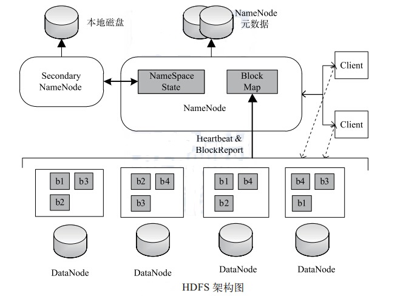
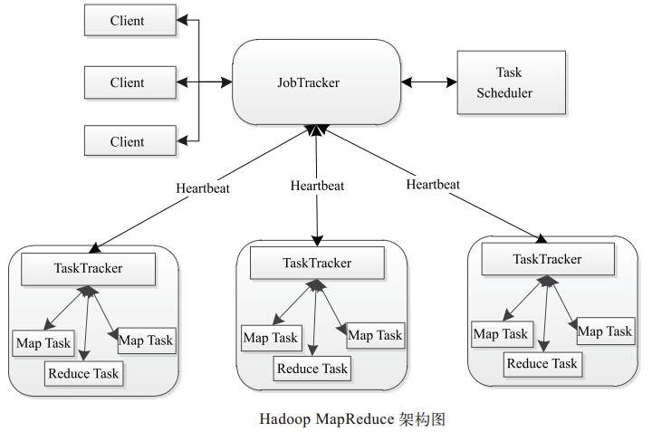
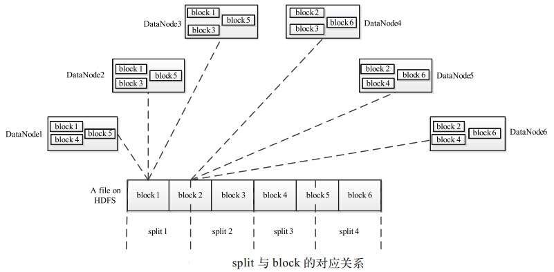
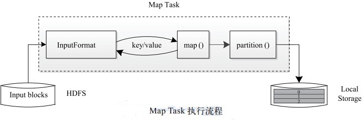

>为什么搭建Hadoop集群？  
以前计算机技术发展以单机计算能力提升为主。按照摩尔定律，每18个月计算机的计算能力就翻一倍。但后来随着计算机技术的迭代升级，从微机到超级计算机，企业发现肝不动了！因为计算机升级成本太高，入不敷出了。但问题是数据量依然在增长，而且可以预见地增长越来越快，即大数据问题。这时候google站出来说，不用超级计算机、用物美价廉的微机也可以搞定，可以将大量的微机以分布式布局的方式连接在一起同样可以搞定大数据问题。随着数据量的增长只需要无脑添加服务器即可。

# Hadoop介绍
## Hadoop的作用：
Hadoop 是一个开源软件框架，用于存储大量数据，并发处理/查询在具有多个商用硬件（即低成本硬件）节点的集群上的那些数据。 （参考资料：https://www.cnblogs.com/gala1021/p/8552850.html）

## Hadoop的运行模式：
1）独立（本地）运行模式：无需任何守护进程，所有的程序都运行在同一个JVM上执行。在独立模式下调试MR程序非常高效方便。所以一般该模式主要是在学习或者开发阶段调试使用。
2）伪分布式模式： Hadoop守护进程运行在本地机器上，模拟一个小规模的集群，换句话说，可以配置一台机器的Hadoop集群,伪分布式是完全分布式的一个特例。
3）完全分布式模式：Hadoop守护进程运行在一个集群上。

## Hadoop的基础组件及架构：
Hadoop是实现了分布式并行处理任务的系统框架，其核心组成是HDFS和MapReduce两个子系统，能够自动完成大任务计算和大数据储存的分割工作。
HDFS系统是Hadoop的储存系统，能够实现创建文件、删除文件、移动文件等功能，操作的数据主要是要处理的原始数据以及计算过程中的中间数据，实现高吞吐量的数据读写。MapReduce系统是一个分布式计算框架，主要任务就是利用廉价的计算机对海量的数据进行分解处理。

## HDFS 架构
HDFS 是一个具有高度容错性的分布式文件系统， 适合部署在廉价的机器上。 HDFS 能提供高吞吐量的数据访问， 非常适合大规模数据集上的应用。HDFS 的架构如图所示， 总体上采用了 master/slave 架构， 主要由以下几个组件组成 ：Client、 NameNode、 Secondary NameNode 和 DataNode。 下面分别对这几个组件进行介绍：


- Client
Client（代表用户） 通过与 NameNode 和 DataNode 交互访问 HDFS 中的文件。 Client提供了一个类似 POSIX 的文件系统接口供用户调用。
- NameNode
整个Hadoop 集群中只有一个 NameNode。 它是整个系统的“ 总管”， 负责管理 HDFS的目录树和相关的文件元数据信息。 这些信息是以“ fsimage”（ HDFS 元数据镜像文件）和“ editlog”（HDFS 文件改动日志）两个文件形式存放在本地磁盘，当 HDFS 重启时重新构造出来的。此外， NameNode 还负责监控各个 DataNode 的健康状态， 一旦发现某个DataNode 宕掉，则将该 DataNode 移出 HDFS 并重新备份其上面的数据。
- Secondary NameNode
Secondary NameNode 最重要的任务并不是为 NameNode 元数据进行热备份， 而是定期合并 fsimage 和 edits 日志， 并传输给 NameNode。 这里需要注意的是，为了减小 NameNode压力， NameNode 自己并不会合并fsimage 和 edits， 并将文件存储到磁盘上， 而是交由Secondary NameNode 完成。
- DataNode
一般而言， 每个 Slave 节点上安装一个 DataNode， 它负责实际的数据存储， 并将数据信息定期汇报给 NameNode。 DataNode 以固定大小的 block 为基本单位组织文件内容， 默认情况下 block 大小为 64MB。 当用户上传一个大的文件到 HDFS 上时， 该文件会被切分成若干个 block， 分别存储到不同的 DataNode ； 同时，为了保证数据可靠， 会将同一个block以流水线方式写到若干个（默认是 3，该参数可配置）不同的 DataNode 上。 这种文件切割后存储的过程是对用户透明的。

## MapReduce 架构
同 HDFS 一样，Hadoop MapReduce 也采用了 Master/Slave（M/S）架构，具体如图所示。它主要由以下几个组件组成：Client、JobTracker、TaskTracker 和 Task。 下面分别对这几个组件进行介绍。

- Client
用户编写的 MapReduce 程序通过 Client 提交到 JobTracker 端； 同时， 用户可通过 Client 提供的一些接口查看作业运行状态。 在 Hadoop 内部用“作业”（Job） 表示 MapReduce 程序。 一个MapReduce 程序可对应若干个作业，而每个作业会被分解成若干个 Map/Reduce 任务（Task）。
- JobTracker
JobTracker 主要负责资源监控和作业调度。JobTracker监控所有TaskTracker与作业的健康状况，一旦发现失败情况后，其会将相应的任务转移到其他节点；同时JobTracker 会跟踪任务的执行进度、资源使用量等信息，并将这些信息告诉任务调度器，而调度器会在资源出现空闲时，选择合适的任务使用这些资源。在 Hadoop 中，任务调度器是一个可插拔的模块，用户可以根据自己的需要设计相应的调度器。
- TaskTracker
TaskTracker 会周期性地通过 Heartbeat 将本节点上资源的使用情况和任务的运行进度汇报给 JobTracker， 同时接收 JobTracker 发送过来的命令并执行相应的操作（如启动新任务、 杀死任务等）。TaskTracker 使用“slot” 等量划分本节点上的资源量。“slot” 代表计算资源（CPU、内存等）。一个Task 获取到一个slot 后才有机会运行，而Hadoop 调度器的作用就是将各个TaskTracker 上的空闲 slot 分配给 Task 使用。 slot 分为 Map slot 和 Reduce slot 两种，分别供 MapTask 和 Reduce Task 使用。 TaskTracker 通过 slot 数目（可配置参数）限定 Task 的并发度。
- Task
Task 分为 Map Task 和 Reduce Task 两种， 均由 TaskTracker 启动。 HDFS 以固定大小的 block 为基本单位存储数据， 而对于 MapReduce 而言， 其处理单位是 split。split 与 block 的对应关系如图所示。 split 是一个逻辑概念， 它只包含一些元数据信息， 比如数据起始位置、数据长度、数据所在节点等。它的划分方法完全由用户自己决定。 但需要注意的是，split 的多少决定了 Map Task 的数目 ，因为每个 split 会交由一个 Map Task 处理。

Map Task 执行过程如图所示。 由该图可知，Map Task 先将对应的 split 迭代解析成一个个 key/value 对，依次调用用户自定义的 map() 函数进行处理，最终将临时结果存放到本地磁盘上，其中临时数据被分成若干个 partition，每个 partition 将被一个Reduce Task 处理。

Reduce Task 执行过程如图所示。该过程分为三个阶段①从远程节点上读取MapTask中间结果（称为“Shuffle 阶段”）；②按照key对key/value对进行排序（称为“ Sort 阶段”）；③依次读取<key, value list>，调用用户自定义的 reduce() 函数处理，并将最终结果存到 HDFS 上（称为“ Reduce 阶段”）。

Hadoop作为解决大数据存储计算的主流解决方案被广泛应用。下面我们在上一篇的基础上将三个虚拟机DW1，DW2，DW3部署到Hadoop集群上。


# 安装的Hadoop前的准备工作

关闭防火墙
```
[root@DW1 ~]# systemctl stop firewalld.service
[root@DW1 ~]# systemctl disable firewalld.service
[root@DW1 ~]# firewall-cmd --state
not running
```
关闭SELINUX
```
# 修改为SELINUX=disabled
[root@DW1 ~]# vi etc/selinux/config

# 重启完成设置
[root@DW1 ~]# reboot
```
安装JDK(安装步骤参考上一篇,此处略)

建立IP与主机名的联系
```
vi /etc/hosts

# 添加内容
192.168.xx.xxx DW1
192.168.xx.xxx DW2
192.168.xx.xxx DW3

#添加完成后可以以DWX代替ip地址，如：
[root@DW1 ~]# ping DW2
```

配置SSH
```
# 通过ssh工具获取公匙密匙
[root@DW1 ~]$ ssh-keygen -t rsa

# 进行ssh搭建
[root@DW1 ~]$ cd .ssh
[root@DW1 ~]$ cp id_rsa.pub authorized_keys
[root@DW1 ~]$ ssh-copy-id dw2
[root@DW1 ~]$ ssh-copy-id dw3

# 这时dw2和dw3已可以对dw1免密码登录
[root@DW1 ~]$ ssh dw2
[root@DW1 ~]$ ssh dw3

#对DW2,DW3也进行相同地操作，保证3台设备可以免密互联
```
# 安装Hadoop
创建一个Hadoop的文件夹存放安装包
```
[root@DW1 ~]# cd /usr/local
[root@DW1 ~]# mkdir hadoop
[root@DW1 ~]# cd hadoop
```
以下两种方式任选一种安装:
1.通过命令行在虚拟机上下载：
```
[root@DW1 hadoop]# wget http://apache.claz.org/hadoop/common/hadoop-3.2.0/hadoop-3.2.0.tar.gz
```
2.通过[下载链接](http://archive.apache.org/dist/hadoop/core/)download至主机,然后再通过XSHELL及lrzsz等工具上传到虚拟机：
```
[root@DW1 hadoop]# yum install -y lrzsz

#通过rz命令进行上传
[root@DW1 hadoop]# rz

```
解压安装包：
```
[root@DW1 hadoop]# tar -xzvf hadoop-3.2.0.tar.gz
```

修改环境变量：
```
[root@DW1 ~]# vi /etc/profile

# 添加以下内容
export HADOOP_HOME=/usr/local/hadoop/hadoop-3.2.0
exprot PATH=$PATH:$HADOOP_HOME/bin

[root@DW1 ~]# source /etc/profile
```
检验是否安装成功：

`[root@DW1 hadoop]# hadoop -version`

# 修改的Hadoop的配置
配置HDFS地址

配置core-site.xml
```
[root@DW1 hadoop-3.2.0]$ cd etc/hadoop
[root@DW1 hadoop]# vi core-site.xml

#在最后添加以下内容
<configuration>
<property>
    <name>fs.default.name</name>
    <value>hdfs://DW1:9000</value>
</property>
</configuration>
```
配置hdfs-site.xml
DW1为主节点，DW2、3为从节点，因此设置两个副本
```
[root@DW1 hadoop]# vi hdfs-site.xml

#在最后添加以下内容
<configuration>
<property>
  <name>dfs.name.dir</name>
  <value>/usr/local/data/namenode</value>
</property>
<property>
  <name>dfs.data.dir</name>
  <value>/usr/local/data/datanode</value>
</property>
<property>
  <name>dfs.tmp.dir</name>
  <value>/usr/local/data/tmp</value>
</property>
<property>
  <name>dfs.replication</name>
  <value>2</value>
</property>
</configuration>
```
配置mapred-site.xml
```
<configuration>
<property>
  <name>mapreduce.framework.name</name>
  <value>yarn</value>
</property>
</configuration>
```

配置yarn-site.xml
```
<configuration>
<property>
  <name>yarn.resourcemanager.hostname</name>
  <value>DW1</value>
</property>
<property>
  <name>yarn.nodemanager.aux-services</name>
  <value>mapreduce_shuffle</value>
</property>
</configuration>
```

配置slaves文件
```
[root@DW1 hadoop-3.2.0]$ vi slaves

# 添加从节点DW2,DW3(如果有默认的localhost，删掉即可)
DW2
DW3
```

配置hadoop-env.sh

```
# 添加JAVA_HOME
export JAVA_HOME=/usr/lib/jvm/java-1.8.0-openjdk-1.8.0.222.b10-0.el7_6.x86_64
```

配置yarn-env.sh
```
# 同样添加添加JAVA_HOME
export JAVA_HOME=/usr/lib/jvm/java-1.8.0-openjdk-1.8.0.222.b10-0.el7_6.x86_64
```

# 完成对从节点的配置
创建data文件夹(DW2,DW3也要创建)
```
[root@DW1 ]# cd /usr/local 
[root@DW1 local]# mkdir data
```
将hadoop拷贝到DW2,DW3
```
[root@DW1 local]# scp -r hadoop DW2:/usr/local
[root@DW1 local]# scp -r hadoop DW3:/usr/local
```
同时DW2,DW3也要配置换环境等
```
#进行检验
[root@DW2 local]# java -version
[root@DW2 local]# hadoop -version
```
# 集群启动
在DW1上节点格式化

`[root@DW1 ~]# hdfs namenode -format`

启动集群

`[root@DW1 ~]# start-dfs.sh`

遇到以下问题：
```
ERROR: Attempting to operate on hdfs namenode as root
ERROR: but there is no HDFS_NAMENODE_USER defined. Aborting operation.
Starting datanodes
ERROR: Attempting to operate on hdfs datanode as root
ERROR: but there is no HDFS_DATANODE_USER defined. Aborting operation.
Starting secondary namenodes [DW1]
ERROR: Attempting to operate on hdfs secondarynamenode as root
ERROR: but there is no HDFS_SECONDARYNAMENODE_USER defined. Aborting operation.
```
在/usr/local/hadoop/hadoop-3.2.0/sbin下， 将start-dfs.sh，stop-dfs.sh两个文件顶部添加以下参数：
```
#!/usr/bin/env bash
HDFS_DATANODE_USER=root
HADOOP_SECURE_DN_USER=hdfs
HDFS_NAMENODE_USER=root
HDFS_SECONDARYNAMENODE_USER=root
```

start-yarn.sh，stop-yarn.sh的顶部添加以下参数：
```
#!/usr/bin/env bash
YARN_RESOURCEMANAGER_USER=root
HADOOP_SECURE_DN_USER=yarn
YARN_NODEMANAGER_USER=root
```

再次启动集群
`[root@DW1 ~]# start-dfs.sh`


参考材料:
[Google三大论文](https://blog.csdn.net/w1573007/article/details/52966742)