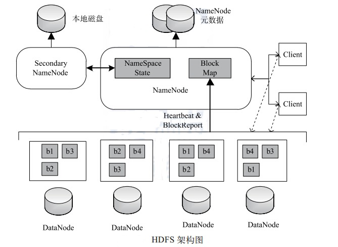

# 认识HDFS
HDFS 是一个具有高度容错性的分布式文件系统， 适合部署在廉价的机器上。 HDFS 能提供高吞吐量的数据访问， 非常适合大规模数据集上的应用。HDFS 的架构如图所示， 总体上采用了 master/slave 架构， 主要由以下几个组件组成 ：Client、 NameNode、 Secondary NameNode 和 DataNode。 下面分别对这几个组件进行介绍：

- Client
Client（代表用户） 通过与 NameNode 和 DataNode 交互访问 HDFS 中的文件。 Client提供了一个类似 POSIX 的文件系统接口供用户调用。
- NameNode
整个Hadoop 集群中只有一个 NameNode。 它是整个系统的“ 总管”， 负责管理 HDFS的目录树和相关的文件元数据信息。 这些信息是以“ fsimage”（ HDFS 元数据镜像文件）和“ editlog”（HDFS 文件改动日志）两个文件形式存放在本地磁盘，当 HDFS 重启时重新构造出来的。此外， NameNode 还负责监控各个 DataNode 的健康状态， 一旦发现某个DataNode 宕掉，则将该 DataNode 移出 HDFS 并重新备份其上面的数据。
- Secondary NameNode
Secondary NameNode 最重要的任务并不是为 NameNode 元数据进行热备份， 而是定期合并 fsimage 和 edits 日志， 并传输给 NameNode。 这里需要注意的是，为了减小 NameNode压力， NameNode 自己并不会合并fsimage 和 edits， 并将文件存储到磁盘上， 而是交由Secondary NameNode 完成。
- DataNode
一般而言， 每个 Slave 节点上安装一个 DataNode， 它负责实际的数据存储， 并将数据信息定期汇报给 NameNode。 DataNode 以固定大小的 block 为基本单位组织文件内容， 默认情况下 block 大小为 64MB。 当用户上传一个大的文件到 HDFS 上时， 该文件会被切分成若干个 block， 分别存储到不同的 DataNode ； 同时，为了保证数据可靠， 会将同一个block以流水线方式写到若干个（默认是 3，该参数可配置）不同的 DataNode 上。 这种文件切割后存储的过程是对用户透明的。
# 熟悉hdfs常用命令
命令基本格式:
```
hadoop fs -cmd < args >
```
**1 )  ls**
列出hdfs文件系统根目录下的目录和文件

```
hadoop fs -ls  /
```
列出hdfs文件系统所有的目录和文件

```
hadoop fs -ls -R /
```
**2) put**
将本地文件上传到hdfs上

```
hadoop fs -put < local file > < hdfs file >
```
hdfs file的父目录一定要存在，否则命令不会执行

```
hadoop fs -put  < local file or dir >...< hdfs dir >
```
hdfs dir 一定要存在，否则命令不会执行

```
hadoop fs -put - < hdsf  file>
```
从键盘读取输入到hdfs file中，按Ctrl+D结束输入，hdfs file不能存在，否则命令不会执行

**moveFromLocal**
```
hadoop fs -moveFromLocal  < local src > ... < hdfs dst >
```
与put相类似，命令执行后源文件 local src 被删除，也可以从从键盘读取输入到hdfs file中

**copyFromLocal**
```
hadoop fs -copyFromLocal  < local src > ... < hdfs dst >
```
与put相类似，也可以从从键盘读取输入到hdfs file中

**3) get**
```
hadoop fs -get < hdfs file > < local file or dir>
```
local file不能和 hdfs file名字不能相同，否则会提示文件已存在，没有重名的文件会复制到本地

```
hadoop fs -get < hdfs file or dir > ... < local  dir >
```
拷贝多个文件或目录到本地时，本地要为文件夹路径
注意：如果用户不是root， local 路径要为用户文件夹下的路径，否则会出现权限问题

```
hadoop fs -copyToLocal < local src > ... < hdfs dst >
```
与get相类似

**4) rm**
```
hadoop fs -rm < hdfs file > 
hadoop fs -rm -r < hdfs dir>
```
每次可以删除多个文件或目录

**5) mkdir**
```
hadoop fs -mkdir < hdfs path>
```
只能一级一级的建目录，父目录不存在的话使用这个命令会报错

```
hadoop fs -mkdir -p < hdfs path> 
```
所创建的目录如果父目录不存在就创建该父目录

**6) getmerge**
```
hadoop fs -getmerge < hdfs dir >  < local file >
```
将hdfs指定目录下所有文件排序后合并到local指定的文件中，文件不存在时会自动创建，文件存在时会覆盖里面的内容

```
hadoop fs -getmerge -nl  < hdfs dir >  < local file >
```
加上nl后，合并到local file中的hdfs文件之间会空出一行

**7. cp**
```
hadoop fs -cp  < hdfs file >  < hdfs file >
```
目标文件不能存在，否则命令不能执行，相当于给文件重命名并保存，源文件还存在

```
hadoop fs -cp < hdfs file or dir >... < hdfs dir >
```
目标文件夹要存在，否则命令不能执行

**8) mv**
```
hadoop fs -mv < hdfs file >  < hdfs file >
```
目标文件不能存在，否则命令不能执行，相当于给文件重命名并保存，源文件不存在

```
hadoop fs -mv  < hdfs file or dir >...  < hdfs dir >
```
源路径有多个时，目标路径必须为目录，且必须存在。
注意：跨文件系统的移动（local到hdfs或者反过来）都是不允许的

**9) count**
```
hadoop fs -count < hdfs path >
```
统计hdfs对应路径下的目录个数，文件个数，文件总计大小
显示为目录个数，文件个数，文件总计大小，输入路径

**10) du**
```
hadoop fs -du < hdsf path> 
```
显示hdfs对应路径下每个文件夹和文件的大小

```
hadoop fs -du -s < hdsf path> 
```
显示hdfs对应路径下所有文件和的大小

```
hadoop fs -du - h < hdsf path> 
```
显示hdfs对应路径下每个文件夹和文件的大小,文件的大小用方便阅读的形式表示，例如用64M代替67108864

**11) text**
```
hadoop fs -text < hdsf file>
```
将文本文件或某些格式的非文本文件通过文本格式输出

**12) setrep**
```
hadoop fs -setrep -R 3 < hdfs path >
```
改变一个文件在hdfs中的副本个数，上述命令中数字3为所设置的副本个数，-R选项可以对一个人目录下的所有目录+文件递归执行改变副本个数的操作

**13) stat**
```
hadoop fs -stat [format] < hdfs path >
```
返回对应路径的状态信息
[format]可选参数有：%b（文件大小），%o（Block大小），%n（文件名），%r（副本个数），%y（最后一次修改日期和时间）

**14) tail**
```
hadoop fs -tail < hdfs file >
```
在标准输出中显示文件末尾的1KB数据

**15) archive**
```
hadoop archive -archiveName name.har -p < hdfs parent dir > < src > < hdfs dst >
```
命令中参数name：压缩文件名，自己任意取；< hdfs parent dir > ：压缩文件所在的父目录；< src >：要压缩的文件名；< hdfs dst >：压缩文件存放路径
示例：hadoop archive -archiveName hadoop.har -p /user 1.txt 2.txt /des
示例中将hdfs中/user目录下的文件1.txt，2.txt压缩成一个名叫hadoop.har的文件存放在hdfs中/des目录下，如果1.txt，2.txt不写就是将/user目录下所有的目录和文件压缩成一个名叫hadoop.har的文件存放在hdfs中/des目录下
``

显示har的内容可以用如下命令：

```
hadoop fs -ls /des/hadoop.jar
```
显示har压缩的是那些文件可以用如下命令

```
hadoop fs -ls -R har:///des/hadoop.har
```
注意：har文件不能进行二次压缩。如果想给.har加文件，只能找到原来的文件，重新创建一个。har文件中原来文件的数据并没有变化，har文件真正的作用是减少NameNode和DataNode过多的空间浪费。

**16) balancer**
```
hdfs balancer
```
如果管理员发现某些DataNode保存数据过多，某些DataNode保存数据相对较少，可以使用上述命令手动启动内部的均衡过程

**17) dfsadmin**
```
dfs dfsadmin -help
```
管理员可以通过dfsadmin管理HDFS，用法可以通过上述命令查看

```
hdfs dfsadmin -report
```
显示文件系统的基本数据

```
hdfs dfsadmin -safemode < enter | leave | get | wait >
```
enter：进入安全模式；leave：离开安全模式；get：获知是否开启安全模式； wait：等待离开安全模式

**18) distcp**
 ```
 hadoop distcp hdfs://master1:8020/foo/bar hdfs://master2:8020/bar/foo
 ```
用来在两个HDFS之间拷贝数据

# Python操作HDFS的其他API
python的pyhdfs模块可以调用HDFS集群的API进行上传、下载、查找等功能，可以用作后期Hadoop的自动化项目，这里我们简要介绍一些pyhdfs里面的一些功能：

**1) HdfsClient类**
class pyhdfs.HdfsClient(hosts=u'localhost', randomize_hosts=True, user_name=None, timeout=20, max_tries=2, retry_delay=5, requests_session=None, requests_kwargs=None)

参数解析：

- hosts:主机名 IP地址与port号之间需要用","隔开 如:hosts="45.91.43.237,9000" 多个主机时可以传入list， 如:["47.95.45.254,9000","47.95.45.235,9000"]*
- randomize_hosts：随机选择host进行连接，默认为True
- user_name:连接的Hadoop平台的用户名
- timeout:每个Namenode节点连接等待的秒数，默认20sec
- max_tries:每个Namenode节点尝试连接的次数,默认2次
- retry_delay:在尝试连接一个Namenode节点失败后，尝试连接下一个Namenode的时间间隔，默认5sec
- requests_session:连接HDFS的HTTP request请求使用的session，默认为None
**2) 返回这个用户的根目录**
*get_home_directory(*kwargs)

**3) 返回可用的namenode节点**
get_active_namenode(max_staleness=None)

**4) 从本地上传文件至集群**
*copy_from_local(localsrc, dest, *kwargs)

**5) 从集群上copy到本地**
*copy_to_local(src, localdest, *kwargs)

**6) 创建新目录**
*mkdirs(path, *kwargs)

参考资料：
[1.Python3调用的Hadoop的API](https://www.cnblogs.com/sss4/p/10443497.html)
[2.pyhdfs使用指导――附代码及运行结果](https://blog.csdn.net/weixin_38070561/article/details/81289601)
# HDFS文件上传和下载过程
**上传文件**
```
# 创建input文件夹
[root@DW1 ~]# hadoop fs -mkdir /input 

# 查看hdfs的文件，可以看到刚才创建的文件夹
[root@DW1 ~]# hadoop fs -ls /
Found 1 items
drwxr-xr-x   - root supergroup          0 2019-07-29 07:13 /input

# 预先上传一个大于128M的文件test.flv到local,然后上传到HDFS
[root@DW1 ~]# cd /usr/local/
[root@DW1 local]# hadoop fs -put test.flv /input

# ls命令可以看到我们刚才上传的文件
[root@DW1 local]# hadoop fs -ls /input
Found 1 items
-rw-r--r--   2 root supergroup  185701130 2019-07-29 07:46 /input/test.flv
```
**下载文件**
```
# 在DW2上下载test.flv
[root@DW2 ~]# cd /usr/local/
[root@DW2 local]# hadoop fs -get /input/test.flv
[root@DW2 local]# ls
bin  data  etc  games  hadoop  include  lib  lib64  libexec  sbin  share  src  test.flv
```
