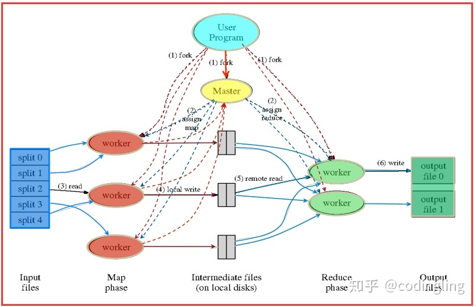
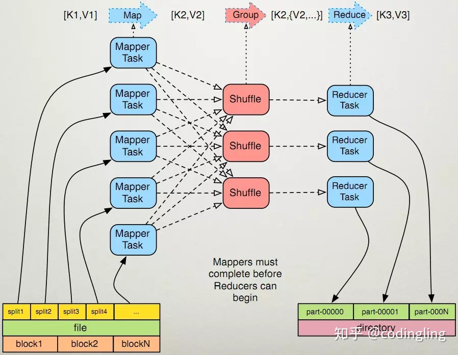

## MR原理

完整的 MapReduce 框架包含两部分：

1.算法逻辑层面，即 map、shuffle 以及 reduce 三个重要算法组成部分；  

2.实际运行层面，即算法逻辑作业在分布式主机中是以什么形式和什么流程运行的，自MapReduceversion2以后，作业都是提交给 YARN 进行管理.

2.0之前只有MapReduce的运行框架，那么它里面有只有两种节点，一个是master，一个是worker。master既做资源调度又做程序调度，worker只是用来参与计算的。但是在2.0之后加入了YARN集群，Yarn集群的主节点承担了资源调度，Yarn集群的从节点中会选出一个节点（这个由redourcemanager决定）用作类似于2.0之前的master的工作，来进行应用程序的调度。


mapreduce就是分治法的一种，将输入进行分片，然后交给不同的task进行处理，然后合并成最终的解。mapreduce实际的处理过程可以理解为**Input->Map->Sort->Combine->Partition->Reduce->Output**。

参考资料:
http://oserror.com/distributed/mapreduce/
https://juejin.im/post/5bb59f87f265da0aeb7118f2

2.0之后，MapReduce框架通常由三个操作（或步骤）组成：  

1.Map：每个工作节点将map函数应用于本地数据，并将输出写入临时存储。主节点确保仅处理冗余输入数据的一个副本。  
  
2.Shuffle：工作节点根据输出键（由map函数生成）重新分配数据，对数据映射排序、分组、拷贝，目的是属于一个键的所有数据都位于同一个工作节点上。  

3.Reduce：工作节点现在并行处理每个键的每组输出数据。



## 使用Hadoop Streaming -python写出WordCount

### Map阶段：mapper.py

把文件保存到hadoop/test/code/mapper.py
```
#!/usr/bin/env python
import sys
for line in sys.stdin:
    line = line.strip()
    words = line.split()
    for word in words:
        print "%s\t%s" % (word, 1)
```

map阶段把每个字符串映射成键、值对，比如这里是把每一行的每个单词映射成（单词，1）。

增加mapper.py的可执行权限
```
chmod +x hadoop/test/code/mapper.py
```
### Reduce阶段：reducer.py

把文件保存到hadoop/test/code/reducer.py
```
#!/usr/bin/env python
from operator import itemgetter
import sys

current_word = None
current_count = 0
word = None

for line in sys.stdin:
    line = line.strip()
    word, count = line.split('\t', 1)
    try:
        count = int(count)
    except ValueError:
        continue
    if current_word == word:
        current_count += count
    else:
        if current_word:
            print "%s\t%s" % (current_word, current_count)
        current_count = count
        current_word = word

if word == current_word:
    print "%s\t%s" % (current_word, current_count)
```

针对map阶段生成的键值映射对，reduce阶段会将其组合生成每个词的计数。

增加reducer.py的可执行权限
```
chmod +x hadoop/test/code/reducer.py
```

功能性测试mapper.py 和 reducer.py
```
cd test/code
//执行命令
echo "foo foo quux labs foo bar quux" | ./mapper.py
//输出内容如下
foo 1
foo 1
quux    1
labs    1
foo 1
bar 1
quux    1
//执行命令
echo "foo foo quux labs foo bar quux" | ./mapper.py | sort -k1,1 | ./reducer.py
//输出内容
bar 1
foo 3
labs    1
quux    2
```
### 在Hadoop上运行python代码

下载[练习文件](http://www.gutenberg.org/cache/epub/4300/pg4300.txt)

把上面的文件放到指定目录下,比如hadoop/test/datas/

把本地的数据文件拷贝到分布式文件系统HDFS中。我直接拷贝到根目录下了。
```
hdfs dfs -put pg4300.txt /pg4300.txt
```

可以在浏览器里输入："虚拟机ip:50070"， 在Utilities-Browse the file system里查看上传的文件。

执行MapReduce job
```
hadoop jar /usr/local/hadoop/share/hadoop/tools/lib/hadoop-streaming-2.7.3.jar \
-input /pg4300.txt \
-output /test/out \
-mapper "python mapper.py" \
-reducer "python reducer.py" \
-file ./mapper.py \
-file ./reducer.py
```

第一行是指明用到的streaming包的位置，第二行指明原文件在HDFS上的路径，第三行是输出结果在HDFS上的路径，输出路径原来不能存在，已存在的话会报错，最后两行指明Map方法和Reduce方法程序路径。


参考资料:  
https://www.linuxidc.com/Linux/2018-08/153597.htm  
https://www.cnblogs.com/kaituorensheng/p/3826114.html
https://www.jianshu.com/p/e3fba578d1a8

## 使用mr计算movielen中每个用户的平均评分

下载[movielen数据集](http://files.grouplens.org/datasets/movielens/)

```
mkdir movielens
cd movielens
wget http://files.grouplens.org/datasets/movielens/ml-1m-README.txt
wget http://files.grouplens.org/datasets/movielens/ml-1m.zip
unzip ml-1m.zip
```  
安装mrjob包
```
conda install -c conda-forge mrjob
```

写出使用mr计算movielen中每个用户的平均评分的python脚本

```
#!/usr/bin/env python
# _*_ coding: utf-8 _*_

# @author: Drizzle_Zhang
# @file: user_ave.py
# @time: 2019/8/3 下午5:46
from abc import ABC

from mrjob.job import MRJob
import numpy as np


class UserAverageRating(MRJob, ABC):
    def mapper(self, key, line):
        # 接收每一行的输入数据，处理后返回一堆key:value，即user：rating
        list_line = line.strip().split('::')
        user = list_line[0]
        rating = int(list_line[2])
        yield user, rating

    def reducer(self, user, ratings):
        # 接收mapper输出的key:value对进行整合，把相同key的value做累加（sum）操作后输出
        yield user, np.mean(list(ratings))


if __name__ == '__main__':
    UserAverageRating.run()
 
 ```  
在本地运行该脚本，并查看结果
```
cd ~/practice/big_data_basis/supp_Task4
python user_ave.py -r local -o user_ave ./movielens/ml-1m/ratings.dat

ls user_ave
part-00000  part-00002  part-00004  part-00006
part-00001  part-00003  part-00005  part-00007

head -6 user_ave/part-00000
"1"	4.1886792453
"10"	4.114713217
"100"	3.0263157895
"1000"	4.130952381
"1001"	3.6525198939
"1002"	4.1363636364
```

## 使用mr实现merge功能。根据item，merge movielen中的 u.data u.item

写出使用mr实现merge功能的python脚本
```

from mrjob.job import MRJob


class Merge(MRJob):
    def mapper(self, _, line):
        list_tab = line.strip().split('\t')
        list_tube = line.strip().split('|')
        if len(list_tab) > 1 and len(list_tube) == 1:
            item_id = list_tab[1]
            user_info = line
            yield item_id, user_info
        elif len(list_tube) > 1 and len(list_tab) == 1:
            item_id = list_tube[0]
            item_info = line
            yield item_id, item_info

    def reducer(self, item_id, info):
        yield item_id, info


if __name__ == '__main__':
    Merge.run()
```

在终端运行该脚本，并查看运行结果
```
python merge.py -r local -o merge ./movielens/ml-100k/u.data ./movielens/ml-100k/u.item 
ls merge
part-00000  part-00002  part-00004  part-00006
part-00001  part-00003  part-00005  part-00007
head -1 merge/part-00000
...

```

## 使用mr实现去重任务  

去重任务的具体形式是，在u.data文件中查看每个user都做出了哪些评级 Python脚本如下

```
from mrjob.job import MRJob


class DeRepetition(MRJob):
    def mapper(self, _, line):
        list_tab = line.strip().split('\t')
        user_id = list_tab[0]
        rating = list_tab[2]
        yield user_id, rating

    def reducer(self, user_id, rating):
        yield user_id, set(rating)


if __name__ == '__main__':
    DeRepetition.run()
```

运行脚本并查看结果

```
python de_rep.py -r local -o de_rep ./movielens/ml-100k/u.data

ls de_rep
part-00000  part-00002  part-00004  part-00006
part-00001  part-00003  part-00005  part-00007

head de_rep/part-00000
"1"	["2","3","1","4","5"]
"10"	["5","4","3"]
"100"	["2","3","1","4","5"]
"101"	["2","3","1","4","5"]
"102"	["1","2","4","3"]
"103"	["2","3","1","4","5"]
"104"	["2","3","1","4","5"]
"105"	["5","2","4","3"]
"106"	["5","2","4","3"]
"107"	["2","3","1","4","5"]
```

## 使用mr实现排序  

排序任务的具体情形是，在u.data文件中查看每个user都做出了哪些评级，并对去重过的评级进行排序
```
from mrjob.job import MRJob
import numpy as np


class Sort(MRJob):
    def mapper(self, _, line):
        list_tab = line.strip().split('\t')
        user_id = list_tab[0]
        rating = int(list_tab[2])
        yield user_id, rating

    def reducer(self, user_id, rating):
        ratings = list(set(rating))
        yield user_id, np.sort(ratings).tolist()


if __name__ == '__main__':
    Sort.run()
python sort.py -r local -o sort ./movielens/ml-100k/u.data

ls sort
part-00000  part-00002  part-00004  part-00006
part-00001  part-00003  part-00005  part-00007

head sort/part-00000
"1"	[1,2,3,4,5]
"10"	[3,4,5]
"100"	[1,2,3,4,5]
"101"	[1,2,3,4,5]
"102"	[1,2,3,4]
"103"	[1,2,3,4,5]
"104"	[1,2,3,4,5]
"105"	[2,3,4,5]
"106"	[2,3,4,5]
"107"	[1,2,3,4,5]
```

### 使用mapreduce实现倒排索引。
倒排索引任务的具体情形是，在u.data文件中查看每个user都做出了哪些评级，并得到去重过的评级的倒排索引

```
from mrjob.job import MRJob
import numpy as np


class ReverseSort(MRJob):
    def mapper(self, _, line):
        list_tab = line.strip().split('\t')
        user_id = list_tab[0]
        rating = int(list_tab[2])
        yield user_id, rating

    def reducer(self, user_id, rating):
        ratings = list(set(rating))
        index_rev = np.argsort(ratings)[::-1]
        yield user_id, index_rev.tolist()


if __name__ == '__main__':
    ReverseSort.run()
python reverse_sort.py -r local -o reverse_sort ./movielens/ml-100k/u.data

head reverse_sort/part-00000
"1"	[4,3,2,1,0]
"10"	[2,1,0]
"100"	[4,3,2,1,0]
"101"	[4,3,2,1,0]
"102"	[3,2,1,0]
"103"	[4,3,2,1,0]
"104"	[4,3,2,1,0]
"105"	[3,2,1,0]
"106"	[3,2,1,0]
"107"	[4,3,2,1,0]
```

### 使用mapreduce计算Jaccard相似度

计算的具体情形是，对u.item里的影片类型进行Jaccard相似度计算,判断各个电影和电影1的相似度

```
from mrjob.job import MRJob
import numpy as np
from sklearn.metrics import jaccard_score


class Jaccard(MRJob):
    def mapper(self, _, line):
        list_tube = line.strip().split('|')
        item_id = list_tube[0]
        item_type = list_tube[5:]
        yield item_id, item_type

    def reducer(self, item_id, item_type):
        ref_type = \
            np.array([0, 0, 0, 1, 1, 1, 0, 0, 0, 0, 0, 0, 0, 0, 0, 0, 0, 0, 0])
        item_type0 = item_type
        for item_type in item_type0:
            item_type = item_type
        item_type = [int(num) for num in item_type]
        if len(item_type) == len(ref_type):
            score = jaccard_score(ref_type, np.array(item_type))
            yield item_id, score


if __name__ == '__main__':
    Jaccard.run()
python Jaccard.py -r local -o Jaccard ./movielens/ml-100k/u.item

head Jaccard/part-00000
"1"	1.0
"10"	0.0
"100"	0.0
"1000"	0.25
"1001"	0.3333333333
"1002"	0.3333333333
"1003"	0.5
"1004"	0.0
"1005"	0.0
"1006"	0.0
```

## 使用mapreduce实现PageRank

```
class PageRank(MRJob):
    def mapper(self, _, line):
        list_line = line.strip().split(' ')
        node0 = list_line[0]
        yield node0, 1

    def reducer(self, node, recurrence):
        n = 3
        n_p = 4
        alpha = 0.8
        values = alpha * sum(recurrence)/n + (1 - alpha)/n_p

        yield node, values


if __name__ == '__main__':
    PageRank.run()
python pagerank.py -r local -o pagerank ./input_page.txt

head pagerank/part-00000
"A"	0.85

head pagerank/part-00001
"B"	0.5833333333
```

