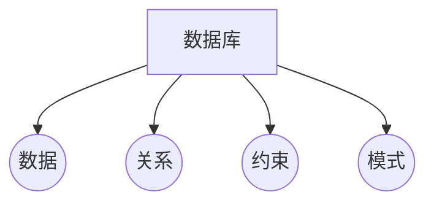
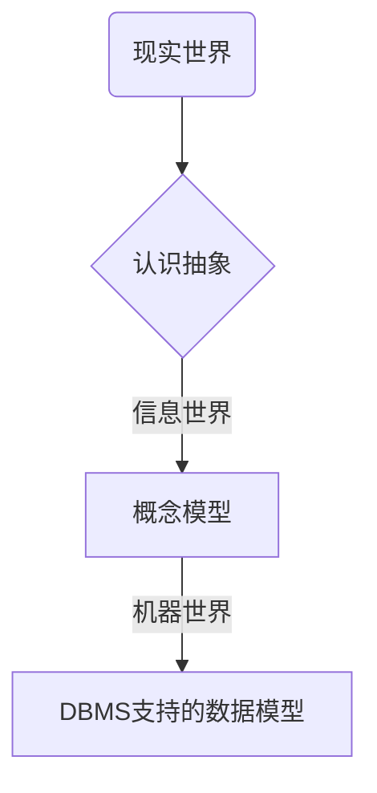
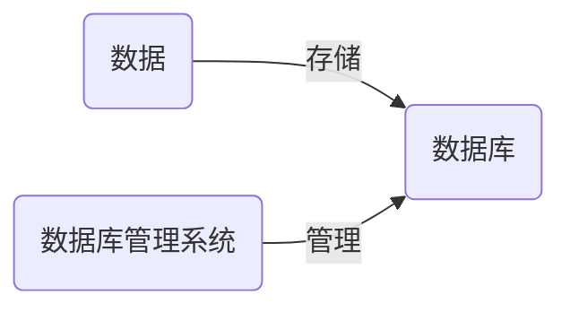

## 2.1数据库扫盲

- 数据库定义
- 如何理解数据库
- 数据是什么，数据和信息的区别
- 数据库管理系统（DBMS）的分类
- 主流关系数据库管理系统（RDBMS）
- 客户端/服务器（C/S）类型结构

> 数据库是被长期存放在计算机内、有组织的、可以表现为多种形式的可共享的数据集合。

以上概念中，“共享”是指数据库中的数据，可让多个不同的用户、使用多种不同的语言、为了不同的目的而同时存储数据库，甚至同一块数据也可以同时存取；“集合”是指某特定应用环境中的各种应用的数据及其数据之间的联系（注意联系也是一种数据）全部集中地按照一定的结构形式进行存储。

> 一个数据库有4个主要组成部分，分别是数据（data）、关系（relationship）、约束（constraint）和模式（schema）。



> 数据是所存储的逻辑实体在计算机中的二进制表示；
> 关系表示数据项之间的某种对应；
> 约束是定义正确数据状态的语言；
> 模式描述数据库中数据的组织和联系；

为了方便理解，之前总是拿档案柜来类比数据库，数据库中的数据表就像是储存在档案柜中一个个的档案文件夹，而数据就是档案记录的材料。这种比喻好在形象生动，缺陷是过于简化，换句话说就是对数据库概念的理解有缺失。如果单纯地将数据库理解为电脑上的档案柜，容易闹出类似想象让多少匹马拉火车才能跑得更快的笑话。

那么到底如何理解数据库呢？

为了搞懂数据库首先得理解数据是什么，理解了数据是什么，数据库无非就是存储数据的仓库。

数据是什么？先看张图：


当人类祖先从生活当中抽象出数的概念后，人类社会开始了有别于地球上其他物种的进化方向。


数据描述了三个领域之间的关系，即从事物特性到计算机的数据表示，经历了三个领域：现实世界、信息世界和机器世界。



> 现实世界：存在于人们头脑之外的客观世界，称为现实世界。 
> 信息世界：是现实世界在人们头脑中的反映。 
> 机器世界：信息世界的信息在机器世界中以数据形式存储。

这里需要澄清两个概念的区别，即数据和信息。开始很多人将两者混淆，这里试举一例帮助厘清。

数字182是数据，如果只是看数字你不会有任何获得，但是当在数字后面加上单位，比如182厘米，你意识到这可能是在描述某个人的身高，你获得了关于某个人身高的信息。这个182厘米就是信息。简单地讲，信息就是有价值的数据。

> 数据库是将大量数据保存起来，通过计算机加工而成的可以进行高效访问的数据集合。该数据集合称为数据库（Database，DB）。用来管理数据库的计算机系统称为数据库管理系统（Database Management System，DBMS）。



上面有提到数据存在多种类型，根据数据类型的不同，目前主流DBMS可以分为以下5种：

> 层次数据库（Hierarchical Database，HDB）
> 关系数据库（Relational Database，RDB）
> 面向对象数据库（Object Oriented Database，OODB）
> XML数据库（XML Database，XMLDB）
> 键值存储系统（Key-Value Store，KVS）

其中关系数据库的数据库管理系统被称为关系数据库管理系统（Relational Database Management System，RDBMS），比较具有代表性的RDBMS有如下5种：

> Oracle Database：甲骨文公司的RDBMS
> SQL Server：微软公司的RDBMS
> DB2：IBM公司的RDBMS
> PostgreSQL：开源的RDBMS
> MySQL：开源的RDBMS

使用 RDBMS 时，最常见的系统结构就是客户端 / 服务器类型（C/S类型）结构，如下图所示：


## 2.2SQL扫盲

- SQL定义
- SQL标准
- 如何有效学习SQL
- SQL语句及其种类
- SQL语法规范

>结构化查询语言(Structured Query Language)简称SQL，是一种特殊目的的编程语言，是一种数据库查询和程序设计语言，用于存取数据以及查询、更新和管理关系数据库系统。

SQL是为了操作数据库而开发的语言，其应用在各种关系数据库管理系统（RDBMS）上。国际标准化组织（ISO）为SQL制定了相应的标准，即[标准SQL](https://time.geekbang.org/column/article/104637)。事实上，完全基于标准SQL的RDBMS很少，通常需要根据不同的RDBMS来编写特定的SQL语句，比如能够在Oracle中使用的SQL语句却无法在SQL Server 中使用，反之亦然。

不过学会标准SQL就可以在各种RDBMS中书写SQL语句了，若是在学习工作中遇到需要使用特定SQL语句的场景利用网络搜索可以解决绝大部分问题。关于特定SQL无需过度担心，到时候用到什么再去查找学习，然后应用记忆就可以了。

话说刚开始接触SQL时，对于其“结构化查询语言”的定义非常无感。结构化是什么？建筑物还是组织结构图？当怀揣不求甚解的态度，听从别人“先用起来用多了就懂了”的建议上手学习一段时间SQL过后，自我感觉学有所成。待过一段时日，工作学习中遇到某个可能需要SQL技能来解决的问题时，才发现自己依然无从下手。特别是学过SQL基础知识之后很少使用的话，很容易忘掉又得重新边做边查，效率很低，继而逐渐放弃。

可是在社会数字化建设的当下，但凡工作涉及到数据相关的内容，就很可能避免不了要使用SQL（从侧面证明SQL的流行与学习掌握SQL的必要性），这是一个典型的从入门到放弃的循环。

那么如何才能有效学习SQL呢？

回答这个问题恰好是本次组队学习的目标之一。此处借用知识迁移的概念尝试做些阐述，至少把自己关于如何达成该目标的路径简单清晰地描述出来，待到组队学习的最后一天将再次对这个问题进行解答。

> 知识迁移就是“一种学习对另一种学习的影响”。在学习这个连续过bai程中， 任何学习都是在学习者已经具有的知识经验和认知结构、已获得的动作技能、习得的态度等基础上进行的。这种原有的知识结构对新的学习的影响就形成了知识的迁移。


知识迁移用大白话描述就是利用旧知识触达新知识。为了将SQL学习这个“新知识”，这里选择的“旧知识”是 Excel 。下至贩浆走卒，上至金融科研，Excel可谓老少皆宜。相比使用SQL需要安装数据库、了解相关标准及语法规范等要求，学习操作Excel的成本几乎为零。

但有个事实是，很多经年使用Excel的人连入门都做不到。日常工作中发现很多人对Excel的痛点集中在不会用函数或者数据透视表方面，更不用说有人花费大量时间精力去学习VBA或者PQ等知识，解决实际问题时恍然发觉，因为自己对业务端的了解不足导致做出来的模板无人问津，一通调研后才明白，其实对方的问题可能仅仅需要一个函数就可以解决。

> 核心：学习掌握Excel的关键诀窍，在于搞懂数据源和维表这两个概念。当你掌握了数据源的标准，当你能够准确快速地分清一张表是一维表还是二维表时，你才算真正地入门Excel 。

因此，概念和标准是两个关键要素。


数据库中存储的表结构（一维表）类似于excel中的行和列，在数据库中，行称为记录，它相当于一条记录，列称为字段，它代表了表中存储的数据项目。行和列交汇的地方称为单元格，一个单元格中只能输入一条记录。

SQL语言基于这一张张表，依托数据库管理系统与数据库展开沟通交流，而人们正是利用SQL语言来实现对这些表进行增删改查的操作。

SQL语言从功能上可以分为三种类型：数据定义、数据操纵和数据控制。

>DDL（Data Definition Language，数据定义语言） 用来创建或者删除存储数据用的数据库以及数据库中的表等对象。如CREATE（创建数据库和表等对象）、DROP（删除数据库和表等对象）、ALTER（修改数据库和表等对象的结构）。
>
>DML（Data Manipulation Language，数据操纵语言） 用来查询或者变更表中的记录。比如SELECT（查询表中的数据）、INSERT（向表中插入新数据）、UPDATE（更新表中的数据）、DELETE（删除表中的数据）。
>
>DCL（Data Control Language，数据控制语言） 用来确认或者取消对数据库中的数据进行的变更。除此之外，还可以对 RDBMS 的用户是否有权限操作数据库中的对象（数据库表等）进行设定。比如COMMIT（确认对数据库中的数据进行的变更）、ROLLBACK（取消对数据库中的数据进行的变更）、GRANT（赋予用户操作权限）、REVOKE（取消用户的操作权限）。

实际使用的 SQL 语句当中有 90% 属于 DML。

既然SQL是一门语言，那么就必然具备语言的属性，比如具备语法规范。就像是中文有主谓宾的语法顺序，英文有时态变化的区分，SQL也有一套属于自己的使用规范，即[SQL语法规范](http://datawhale.club/t/topic/798) 。使用SQL常见注意事项：

```tex
1.MySQL本身不区分大小写，但强烈要求关键字大写，表名、列名用小写；
2.创建表时，使用统一的、描述性强的字段命名规则保证字段名是独一无二且不是保留字的，不要使用连续的下划线，不用下划线结尾,最好以字母开头;
3.关键字右对齐，且不同层级的用空格或缩进控制，使其区分开；
4.列名少的时候写在一行里无伤大雅；多的时候以及涉及到CASE WHEN 或者聚合计算的时候，建议分行写；
5.表别名和列别名尽量用有具体含义的词组，不要用a b c，不然以后review的时候会非常痛苦；
6.运算符前后都加一个空格；
7.当用到多个表时，请在所有列名前写上引用的表别名，不要嫌麻烦；
8.每条命令用分号结尾；
9.养成随手写注释的习惯;
```

## 2.3小结

通过对数据和数据类型的理解，继而掌握了解数据库概念的关键，在此基础上对数据库管理系统的种类、主流关系数据库管理系统及其主要的系统架构进行了解。SQL运行在数据库管理系统上，有其一套完整的标准和语法规范，通过知识迁移的方法可以帮助我们有效学习掌握SQL语言的相关知识。


## 2.4练习题

> 编写一条 CREATE TABLE 语句，用来创建一个包含表 1-A 中所列各项的表 Addressbook （地址簿），并为 regist_no （注册编号）列设置主键约束
>
> 表1-A 表 Addressbook （地址簿）中的列


```mysql
CREATE TABLE Addressbook (
	regist_no INT NOT NULL,
	NAME VARCHAR (128) NOT NULL,
	address VARCHAR (256) NOT NULL,
	tel_no CHAR (10),
	mail_address CHAR (20),
	PRIMARY KEY (regist_no)
);
```

> 假设在创建练习1.1中的 Addressbook 表时忘记添加如下一列 postal_code （邮政编码）了，请把此列添加到 Addressbook 表中。
>
> 列名 ： postal_code
>
> 数据类型 ：定长字符串类型（长度为 8）
>
> 约束 ：不能为 NULL

```mysql
ALTER TABLE Addressbook ADD COLUMN postal_code CHAR (8) NOT NULL;
```

>编写 SQL 语句来删除 Addressbook 表。

```mysql
 DROP TABLE Addressbook;
```

> 编写 SQL 语句来恢复删除掉的 Addressbook 表。

```mysql
# 注意 DROP TABLE 语句执行之后无法恢复，只能重新建表
CREATE TABLE Addressbook
(regist_no INTEGER NOT NULL,
 na_me VARCHAR(128) NOT NULL,
 address VARCHAR(256) NOT NULL,
 tel_no CHAR(10),
 mail_address CHAR(20),
 postal_code CHAR(8) NOT NULL，
 PRIMARY KEY (regist_no));
```


## 参考资料

- [数据库系统概论（第四版）](https://book.douban.com/subject/1945005/)
- [SQL基础教程](https://book.douban.com/subject/27055712/)
- [drop、truncate和delete的区别](https://www.cnblogs.com/zhizhao/p/7825469.html)

