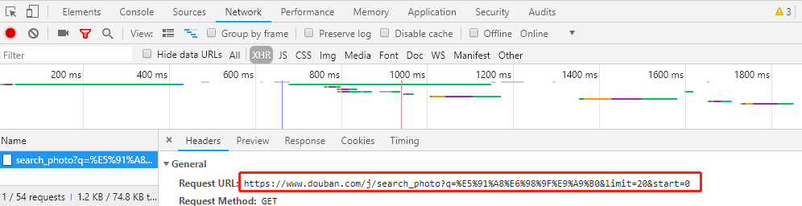
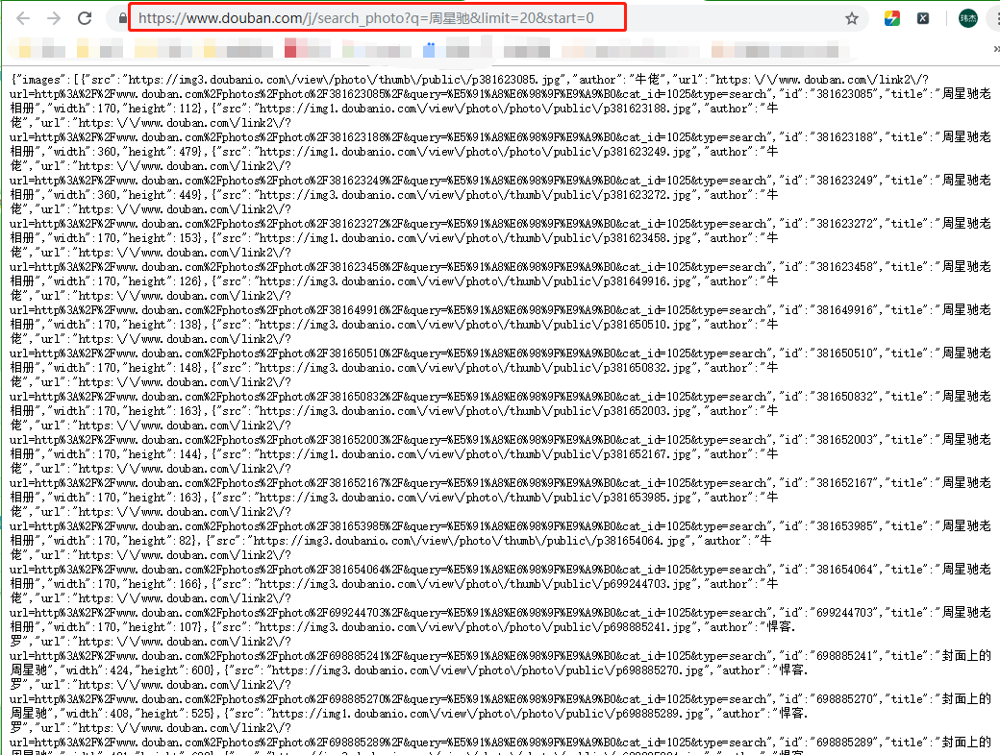
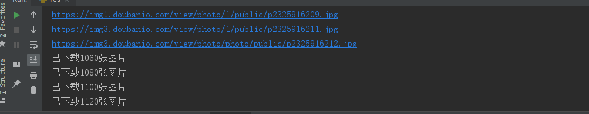
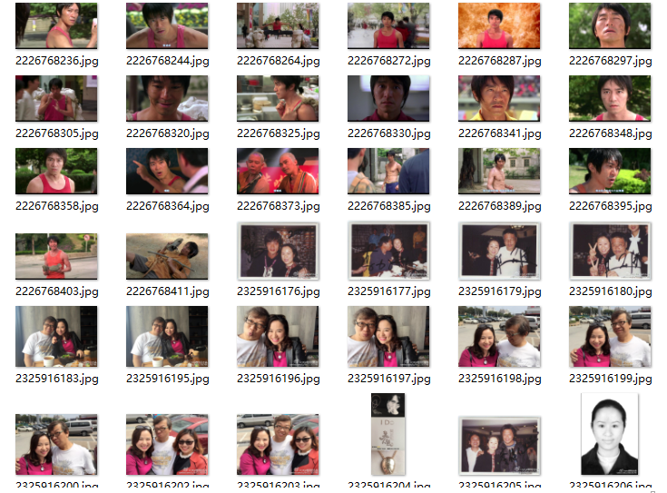

> 项目以抓取豆瓣网周星驰图片为例对基本的爬虫过程进行说明

爬虫流程分为三个阶段:打开网页、提取数据和保存数据

建议初学者采取跟流程相反的顺序依次进行代码块的编写，即保存数据、提取数据和打开网页。这样做的好处是容易理解和快速上手。下面进行一一说明。

# 第一步:保存数据

首先,需要为下载的图片找一个存储的位置，比如一个文件夹，如果没有那就创建一个。

```
#!/usr/bin/python
# -*- coding: UTF-8 -*-

import json
import re
import os
import requests

# 创建图片存储文档
query = '周星驰'
path = os.getcwd()
picpath = path + '/' + query
print(picpath)
if not os.path.isdir(picpath):
    os.mkdir(picpath)
```

# 第二步:提取数据

其次,编写下载函数,我们这次是要抓取图片,那么只需要关注两个变量,一个是图片的下载链接地址,另一个是图片id.因此给下载函数传参这两个变量即可.需要注意的是,为防止因请求网页超时或者图片链接失效,导致程序停止,这里需要一个exception

```
    
# 创建下载函数
def download(src, id):
    dir = picpath + '/' + str(id) + '.jpg'
    try:
        pic = requests.get(src, timeout=10)
    except requests.exceptions.ConnectionError:
        print(id + '图片无法下载')
    fp = open(dir, 'wb')
    fp.write(pic.content)
    fp.close()
```

# 第三步:打开网页

最后进行循环部分代码的编写,即请求 url.先进入下面给出的链接，然后  F12 打开开发者工具，点击 Newwork，然后再点击 XHR（XMLHttpRequest），接着 F5 刷新一下页面就能看到 search_photo?q= 那一串东西，点击它，接着去点击一下

Headers，最后就能看到 Request URL.



正常的话,将这个地址复制后在浏览器打开会显示如下结果:



多试几次就能发现 Request URL 的规律了，start=0，start=20，start=40.翻到最下面你会发现'total'字样.这里因为只是测试,所有我将总数设置为2000.

另外需要注意的是把图片链接中的 thumb 全部替换成了l，因为测试的时候发现替换之后的图片是大图.关于这一点多观察刷新几次就可以得出结论,并且是具体问题具体分析的,在豆瓣是这样,换个网站就是另外的情况了.

```
    
# 抓取图片地址与id
for i in range(0, 2000, 20):
    url = 'https://www.douban.com/j/search_photo?q=' + query + '&limit=20&start=' + str(i)
    html = requests.get(url).text
    response = json.loads(html,encoding = 'uft-8')
    print('已下载' + str(i) + '张图片')
    for image in response['images']:
        image['src'] = image['src'].replace('thumb', 'l')
        print(image['src'])
        download(image['src'], image['id'])
```

如果你编写的代码没有问题的话,会显示类似下图



好了,剩下时间你就可以慢慢欣赏了!


